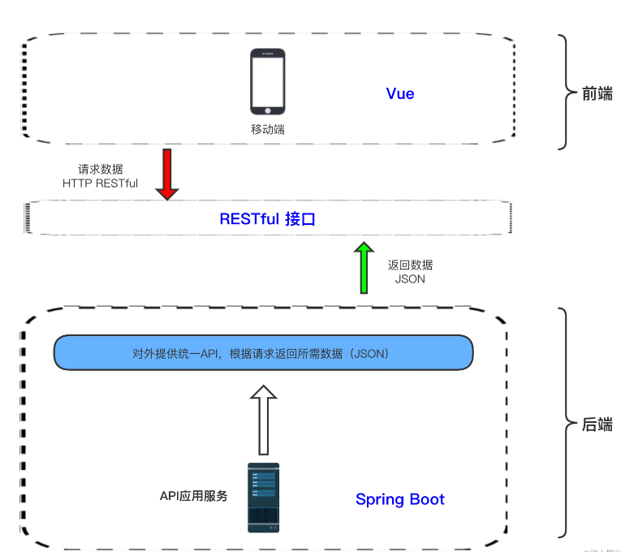

---
# 1.需求调研与分析

## 1.1项目背景
newbee-mall商城致力于提供以产品展示及订购为核心的在线购物服务app，让客户能够便捷自由地选择地购买产品。
项目分为两个系统模块:

### - 用户前台系统
包含首页门户、商品分类、新品上线、首页轮播、商品推荐、商品搜索、商品展示、购物车、订单结算、订单流程、个人订单管理、会员中心、帮助中心等模块。
### - 管理员后台系统
	

 1. 首页配置：轮播图配置、热销商品配置、新品上线配置、为你推荐配置
 2. 商品管理：商品上架状态管理
 3. 会员管理：用户身份状态的查看与管理
 4. 订单管理：对订单支付，配货，交易完成及出库的一系列操作管理

# 2.概要设计
## 2.1界面原型设计
登录

注册

首页

商品搜索

购物车

购物车1

商品详情

生成订单

生成订单1

我的订单

用户信息界面

地址管理

## 2.2用例图

## 2.3类图设计

## 2.4项目架构图
项目以 Spring Boot 和 Vue3 技术栈为主线，采用前后端分离架构：
后端主要技术栈：springboot
前端主要技术栈：Vue3 + Vue-Router4 +Vuex4+Vant3+Axios

