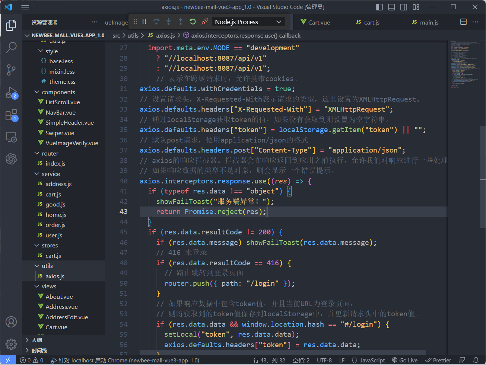
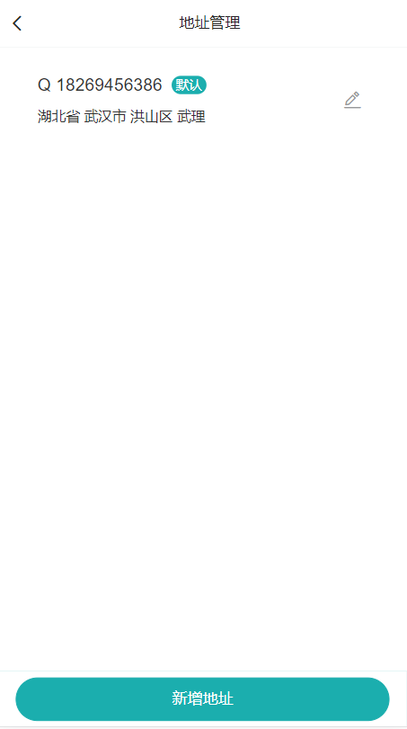

---

# 1.需求调研与分析

## 1.1项目背景
newbee-mall商城致力于提供以产品展示及订购为核心的在线购物服务app，让客户能够便捷自由地选择地购买产品。
项目分为两个系统模块:

### - 用户前台系统
包含首页门户、商品分类、新品上线、首页轮播、商品推荐、商品搜索、商品展示、购物车、订单结算、订单流程、个人订单管理、会员中心、帮助中心等模块。
### - 管理员后台系统
	

 1. 首页配置：轮播图配置、热销商品配置、新品上线配置、为你推荐配置
 2. 商品管理：商品上架状态管理
 3. 会员管理：用户身份状态的查看与管理
 4. 订单管理：对订单支付，配货，交易完成及出库的一系列操作管理

##  1.2性能需求

### - 响应特性

| 响应特性 | 内容                                                                                                                                                                             |
| -------- | -------------------------------------------------------------------------------------------------------------------------------------------------------------------------------- |
| 响应时间 | 数据查询响应时间<5s<br/>页面跳转时间<=3s<br/>数据传送时间<2s<br/>精确识别反馈结果<=2s                                                                                            |
| 优化     | 从产品体验出发做优化，当页面数据量大导致加载时间过长，给用户提供加载进度条，预计加载时间，减少用户焦虑。以及日常使用的分页加载，每次加载部分数据，当用户进行操作时，再逐步加载。 |

### - 架构特性需求

| 架构特性 | 内容                                                                                                                                                                             |
| -------- | -------------------------------------------------------------------------------------------------------------------------------------------------------------------------------- |
| 稳定性   | 系统合理的利用资源，保证前后台数据操作的效率，以及在数据响应和界面承载方面都要达到不会出现界面混乱、数据报错、触发按钮功能缺失、操作频繁或者快速容易崩溃的问题。                 |
| 灵活性   | APP能够适应主流手机屏幕; 当需求发生某些变化时，该软件的基本操作、数据结构、运行环境等等基本不会发生变化，只是对系统的数据库的文件和记录进行处理，就可以满足需求。                |
| 扩充性   | 保证已有平台和系统的兼容性及对未来发展的适应性，使系统可在原有的基础升级改造和更新，并充分考虑技术进步因素的影响。                                                               |
| 开放性   | 产品不是一个封闭的系统，今后可通过接口和其他平台或系统相连，在平台建设中充分考虑与外界信息系统交换的需求，保证既能满足基本功能的需要，有具有与外界系统进行信息交换与处理的能力。 |


# 2.概要设计
## 2.1前台系统界面原型设计
登录


注册


首页


商品搜索


购物车


购物车1


商品详情


生成订单


生成订单1


我的订单


用户信息界面


地址管理


## 2.2后台系统界面原型设计
首页


添加商品


首页配置——轮播图配置


首页配置——热销商品配置


首页配置——新品上线配置


首页配置——为你推荐配置


模块管理——商品管理


模块管理——会员管理


模块管理——订单管理


修改密码


# 2.3用例图


## 2.4类图设计


## 2.5项目架构图
项目以 Spring Boot 和 Vue3 技术栈为主线，采用前后端分离架构：
后端主要技术栈：springboot
前端主要技术栈：Vue3 + Vue-Router4 +Vuex4+Vant3+Axios


## 3 前端详细设计

### 3.1前台用户系统详细设计
前台 用户系统主要使用Vue3 + Vant3 实现界面设计与交互，使用Axios库来发送HTTP请求。

Axios是一个基于Promise的HTTP客户端，用于处理与服务器的通信。


使用vue router实现路由的跳转和管理。
在路由配置文件中，我们定义了很多路由路径和组件的映射关系。每个路由路径都对应一个组件，并且可以通过路由名称来访问这个路径。路由还可以通过 meta 属性来设置一些额外的信息，比如索引值。通过创建一个 Vue Router 实例，并配置了一些路由路径和对应的组件。这样，在应用中就可以使用这个路由实例来进行路由跳转和管理。


配置vant


#### 登录/注册界面

登录和注册页面使用了Vue 3的Composition API进行开发。能够根据用户的输入进行切换和提交登录或注册表单，并对验证码进行验证。


login和register是对用户登录和注册的后端API请求封装的函数。

``` 
export function login(params) {
  // ====params参数包含了需要提交的用户信息。
  return axios.post('/user/login', params);
}

export function register(params) {
  return axios.post('/user/register', params);
}
```

登录界面对用户输入密码进行MD5解析获取。根据state.type的值来显示登录或注册内容。
``` 
if (state.type == "login") {
    const { data } = await login({
      loginName: values.username,
      passwordMd5: md5(values.password),
    });
    setLocal("token", data);
    // 需要刷新页面，否则 axios.js 文件里的 token 不会被重置
    window.location.href = "/";
  } else {
    await register({
      loginName: values.username1,
      password: values.password1,
    });
    showSuccessToast("注册成功");
    state.type = "login";
    state.verify = "";
  }
```
对于验证码的实现，我们设计了一个自定义的vueImgVerify验证码图片组件。其中，使用了vant库的van-form和van-field组件来构建表单，v-model指令用于实现表单字段与state中的数据绑定，:rules属性可以设置表单字段的验证规则。

``` 
		<van-field
          center
          clearable
          label="验证码"
          placeholder="输入验证码"
          v-model="state.verify"
        >
          <template #button>
            <vue-img-verify ref="verifyRef" />
          </template>
        </van-field>
```


### 首页界面


首页的布局，包含了商城的头部、导航栏、轮播图和首页商品显示栏等内容。在头部中有一个头部搜索框和商城名称，以及用户icon,使用<router-link >  标签可以实现链接的跳转。
新品上线商品列表，使用了van-skeleton组件展示加载状态，循环渲染state.newGoodses数组中的商品数据。每个商品都包含商品图片、商品描述和价格。热门商品和最新推荐的商品部分与新品上线的商品部分代码结构相同，只是展示的数据源不同。


引用vue nextTick（）监听页面滚动事件，当页面滚动距离超过100时，改变页面上的头部样式,实现良好的界面交互。

``` 
nextTick(() => {
  document.body.addEventListener("scroll", () => {
    let scrollTop =
      window.pageYOffset ||
      document.documentElement.scrollTop ||
      document.body.scrollTop;
    scrollTop > 100
      ? (state.headerScroll = true)
      : (state.headerScroll = false);
  });
});
```
getHome 向后端发送get请求用于获取首页数据，getLocal用于获取本地存储的数据

``` 
const { data } = await getHome();
```
轮播图功能的实现使用了Vant UI库的Swipe（轮播）组件。

``` 
<template>
  <!-- 该组件的autoplay属性设置为3000，表示每隔3秒自动播放一张轮播图。indicator-color属性设置了指示器的颜色为"#1baeae"。 -->
  <van-swipe class="my-swipe" :autoplay="3000" indicator-color="#1baeae">
    <van-swipe-item v-for="(item, index) in list" :key="index">
      
    </van-swipe-item>
  </van-swipe>
</template>

```
### 搜索框
点击搜索框跳转至product-list商品搜索列表界面。界面包括推荐，新品，价格三种标签栏，是由van-tabs组件实现的标签栏的划分，点击标签会触发changeTab方法进而实现标签栏的切换。


使用van-list组件呈现商品信息，使用了v-for循环遍历了state.productList数组，并使用v-if条件语句判断state.productList数组的长度，根据不同的情况展示不同的视图。如果state.productList数组的长度大于0，表示有产品数据，就会渲染每个产品项的视图。每个产品项的视图包含了产品的图片、信息和价格。

``` 
<template v-if="state.productList.length">
            <div
              class="product-item"
              v-for="(item, index) in state.productList"
              :key="index"
              @click="productDetail(item)"
            >
              
              <div class="product-info">
                <p class="name">{{ item.goodsName }}</p>
                <p class="subtitle">{{ item.goodsIntro }}</p>
                <span class="price">￥ {{ item.sellingPrice }}</span>
              </div>
            </div>
          </template>
```
对于搜索页面数据的获取，首先从路由参数中获取categoryId，如果categoryId和keyword都不存在，则将state.finished设置为true，表示数据加载完成，然后返回。否则，调用search函数进行商品搜索，传入对应的参数。其中，
pageNumber表示当前页码
goodsCategoryId表示商品分类ID
keyword表示搜索关键字
orderBy表示排序方式
通过解构赋值方式，将搜索结果的data属性和list属性保存在data和list变量中。然后将搜索结果中的商品列表(list)拼接到state.productList数组中，更新总页数(totalPage)和数据加载状态(loading)。最后，如果当前页码大于等于总页数，将state.finished设置为true。

``` 
const init = async () => {
  const { categoryId } = route.query;
  if (!categoryId && !state.keyword) {
    state.finished = true;
    state.loading = false;
    return;
  }
  const {
    data,
    data: { list },
  } = await search({
    pageNumber: state.page,
    goodsCategoryId: categoryId,
    keyword: state.keyword,
    orderBy: state.orderBy,
  });
```
点击商品直接跳转至商品详情页面，是通过router.push方法，传入商品详情页的路径(/product/${item.goodsId})实现页面跳转。

### 商品详情界面


定义了一个goBack方法，用于返回上一页。

```
const goBack = () => {
  router.go(-1)
}

```

定义了一个goTo方法，用于跳转到购物车页面。

``` 
const goTo = () => {
  router.push({ path: '/cart' })
}
```

定义了一个handleAddCart方法，用于处理添加商品到购物车的逻辑。首先调用addCart方法向后端发送请求，添加商品到购物车，然后根据接口返回的resultCode判断添加是否成功，并通过showSuccessToast方法显示添加成功的提示信息。最后，通过cart.updateCart()方法更新购物车的状态。

``` 
const handleAddCart = async () => {
  const { resultCode } = await addCart({ goodsCount: 1, goodsId: state.detail.goodsId })
  if (resultCode == 200) showSuccessToast('添加成功')
  cart.updateCart()
}
```

定义了一个goToCart方法，用于处理直接跳转到购物车页面的逻辑。首先调用addCart方法向后端发送请求，添加商品到购物车，然后通过cart.updateCart()方法更新购物车的状态，最后通过router.push方法跳转到购物车页面。

``` 
const goToCart = async () => {
  await addCart({ goodsCount: 1, goodsId: state.detail.goodsId })
  cart.updateCart()
  router.push({ path: '/cart' })
}
```

### 购物车界面


在购物车中，我们可以通过 Vuex 将购物车的状态（如商品列表、数量、总价等）存储在全局的购物车商店中，并在不同的组件中共享和使用这些状态。这样，无论在用户哪个组件中进行添加商品、更新购物车等操作，都能保持购物车状态的一致性，从而提供更好的购物体验。
Vuex 的作用：Vuex 是用于管理共享状态的库，特别适用于我们大型 Vue 应用程序，可以集中管理组件之间的状态。通过 Vuex，可以将状态存储在全局 Store 中，而不是在多个组件中之间进行传递。这样可以避免状态的混乱和难以维护，同时使得状态的变更和管理更加简单和可预测。


``` 
const cart = useCartStore(); // 获取使用Vuex进行状态管理的购物车store
```

``` 
export const useCartStore = defineStore("cart", () => {
  const count = ref(0);
  async function updateCart() {
    const { data = [] } = await getCart();
    count.value = data.length;
  }

  return { count, updateCart };
});
```


### 地址管理




我们定义了三个事件处理函数。onAdd函数用来跳转到添加地址页面，它通过router.push方法来导航到address-edit路径，并传递相应的参数。

onEdit函数用来跳转到地址编辑页面，它也通过router.push方法来导航，传递了编辑类型、地址ID和来源页面的参数。

最后一个函数是select函数，它在用户选择了某个地址后被调用。它通过router.push方法跳转到订单生成页面，并传递了选择的地址ID和来源页面的参数。

``` 

// 前往添加地址页面
const onAdd = () => {
  router.push({ path: 'address-edit', query: { type: 'add', from: state.from  } })
}
// 前往地址编辑页面
const onEdit = (item) => {
  router.push({ path: 'address-edit', query: { type: 'edit', addressId: item.id, from: state.from  } })
}
// 选择某个地址后，跳回订单生成页面
const select = (item, index) => {
  router.push({ path: 'create-order', query: { addressId: item.id, from: state.from  } })
}
```

### 生成订单


支付窗口使用Vue.js和Vant组件库创建的弹出窗口。

van-popup组件：这是一个弹出窗口组件，通过v-model:show属性来控制显示与隐藏。

position="bottom"：设置弹出窗口在底部显示。

:style="{ height: '24%' }"：设置弹出窗口的高度为父容器高度的24%。

``` 
  <van-popup
      v-model:show="state.showPay"
      position="bottom"
      :style="{ height: '24%' }"
    >
      <div :style="{ width: '90%', margin: '0 auto', padding: '20px 0' }">
        <van-button
          :style="{ marginBottom: '10px' }"
          color="#1989fa"
          block
          @click="handlePayOrder(state.detail.orderNo, 1)"
          >支付宝支付</van-button
        >
        <van-button
          color="#4fc08d"
          block
          @click="handlePayOrder(state.detail.orderNo, 2)"
          >微信支付</van-button
        >
      </div>
    </van-popup>
  </div>
  
```

通过向后端发送get请求获取订单状态，状态和下单时间等信息并通过vue和vant组件渲染到界面上。


### 我的订单

用户可以通过选项卡切换不同状态的订单，下拉刷新和上拉加载更多订单数据。


### 账号管理


通过向后端发送post请求可以修改用户信息。


